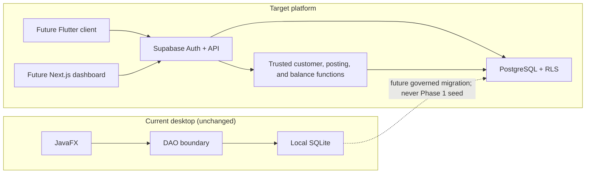

# Architecture

## Current and target states

The existing JavaFX application remains an independent offline SQLite client.
The backend slice runs on local Supabase: PostgreSQL supplies durable data, RLS,
and narrowly scoped database functions for atomic customer/account creation,
fuel-credit posting, repayment posting, daily interest accrual, and authorized
balance reads. No client is connected in Phase 2C.

## Tenant and identity model

An organization is the tenant boundary. Stations belong to one organization. Supabase Auth owns authentication; `profiles` contains non-secret application profile data. Membership rows record active/revoked affiliation, while role assignments grant OWNER, MANAGER, ATTENDANT, CUSTOMER, or DRIVER at a constrained organization/station scope.

Authorization never trusts role or tenant identifiers supplied as an actor claim. RLS helpers derive the caller from `auth.uid()` and query authorization rows inside a private schema to avoid recursive RLS.

## Trusted operation boundary

Direct clients cannot insert or mutate customer, account, product, ledger,
idempotency, sale, or audit records. `create_customer_with_credit_account`
admits an active owner or the station's active manager.
`post_fuel_credit_transaction` admits an active owner, station manager, or
station attendant. `post_customer_repayment` admits the same station-side
roles and records either customer delivery or a validated active linked driver.
All mutation functions derive `auth.uid()`, tenant, station, customer, and
actor role in the database, fix an empty `search_path`, and return only safe
projections.

Fuel and repayment posting first claim an operation-scoped idempotency key,
then take the same credit-account row lock. That consistent ordering serializes
competing debits and credits while allowing same-key requests to wait for and
replay the original result. Repayment recalculates principal and interest after
the lock and rejects overpayment rather than creating unallocated credit.

The private interest engine takes the same credit-account `FOR UPDATE` lock.
It resolves effective policy history, derives FIFO remaining fuel lots from
ledger entries, writes immutable account/day and component evidence, and posts
only a positive whole-paise result. Normal clients and `service_role` cannot
execute the engine or mutate its evidence.

## Data-access model

- Protected tables deny anonymous access.
- Authenticated clients receive only required table privileges; RLS further restricts rows.
- Owners see only owned organizations.
- Managers see only assigned station scope.
- Attendants receive no broad customer or ledger browse. They may execute the
  fuel and repayment posting functions and read one exact account's obligations
  only for their active assigned station.
- Customers see only records linked to their Auth user.
- Drivers read their own driver and permission rows. A no-argument privileged function returns a minimal parent-account projection, because row policies alone cannot safely provide role-dependent column redaction through the shared `authenticated` database role.
- Owners and assigned managers may read repayment/allocation rows in financial
  station scope. Attendants receive the safe receipt but no broad repayment
  browse.
- Owners may read interest runs/evidence in owned organizations; managers only
  at assigned stations. Attendants, customers, drivers, anonymous users, and
  `service_role` have no broad calculation-table access.
- Role, membership, and QR mutations remain reserved for future trusted
  workflows. Audit inserts occur only inside trusted mutation functions; audit
  updates and deletes remain impossible.

## Financial architecture

Every stored INR amount is integer paise in `BIGINT`; interest rates are exact
`NUMERIC`. Posted ledger entries are the balance source of truth. A deferred
constraint trigger requires balanced entries before commit, while mutation
triggers reject updates and deletes even through privileged SQL. Repayment
allocation totals and transaction-specific entry shapes are also checked at
commit. Principal and posted interest are derived from separate receivable
accounts; total due is their sum, while available credit is the configured
limit minus principal only. No client input or mutable cached balance is
authoritative.

Stations store canonical IANA timezones. Principal-affecting transactions
capture an immutable station-local business date. A named hourly pg_cron job
invokes a fixed private entry point; each station processes only through its
last completed local date, with bounded chronological catch-up.

## Audit and secrets

Audit rows have no update or delete path and a trigger rejects mutation even for accidental privileged writes. Audit JSON must be deliberately minimized and must never include passwords, JWTs, QR tokens, service-role keys, or unnecessary personal data.

QR payloads contain only a high-entropy opaque token. The database stores its one-way hash and lifecycle metadata, not the displayed secret or customer/account data.

## Deployment boundaries

Phase 2C runs only against the local Supabase containers. Future environments
will use separate Supabase projects, migrations promoted through CI/CD,
environment-specific public URLs/anon keys, and server-only service
credentials. Browser/mobile clients must never contain the service-role key.

## Deliberate exclusions

No Flutter/Next.js work, QR resolution, customer or driver posting authority,
client-facing interest-charge RPC,
overpayment/customer credit, non-cash method, refund, reversal, real-data
import, remote project, inventory, pump/nozzle, cash reconciliation, or
attendance implementation is part of Phase 2C.
