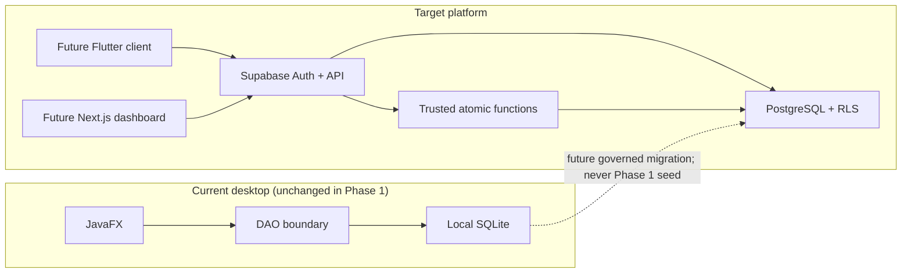

# Architecture

## Current and target states

The existing JavaFX application remains an independent offline SQLite client during Phase 1. The new backend foundation is local Supabase: PostgreSQL for durable data and RLS, Supabase Auth identities, and later narrowly scoped database functions or Edge/server functions for atomic business operations.

## Tenant and identity model

An organization is the tenant boundary. Stations belong to one organization. Supabase Auth owns authentication; `profiles` contains non-secret application profile data. Membership rows record active/revoked affiliation, while role assignments grant OWNER, MANAGER, ATTENDANT, CUSTOMER, or DRIVER at a constrained organization/station scope.

Authorization never trusts role or tenant identifiers supplied as an actor claim. RLS helpers derive the caller from `auth.uid()` and query authorization rows inside a private schema to avoid recursive RLS.

## Data-access model

- Protected tables deny anonymous access.
- Authenticated clients receive only required table privileges; RLS further restricts rows.
- Owners see only owned organizations.
- Managers see only assigned station scope.
- Attendants receive no broad customer browse or financial write policy in Phase 1.
- Customers see only records linked to their Auth user.
- Drivers read their own driver and permission rows. A no-argument privileged function returns a minimal parent-account projection, because row policies alone cannot safely provide role-dependent column redaction through the shared `authenticated` database role.
- Role, membership, QR, and audit mutations are reserved for future trusted server-side workflows.

## Financial architecture

Every INR amount is an integer number of paise in `BIGINT`; interest rates are exact `NUMERIC`. Phase 1 stores credit configuration but no authoritative balance. The next slice will introduce a double-entry, append-only ledger and one atomic posting operation that validates available credit, writes ledger entries, and writes an immutable audit event under one transaction and idempotency key.

## Audit and secrets

Audit rows have no update or delete path and a trigger rejects mutation even for accidental privileged writes. Audit JSON must be deliberately minimized and must never include passwords, JWTs, QR tokens, service-role keys, or unnecessary personal data.

QR payloads contain only a high-entropy opaque token. The database stores its one-way hash and lifecycle metadata, not the displayed secret or customer/account data.

## Deployment boundaries

Phase 1 runs only against the local Supabase containers. Future environments will use separate Supabase projects, migrations promoted through CI/CD, environment-specific public URLs/anon keys, and server-only service credentials. Browser/mobile clients must never contain the service-role key.

## Deliberate exclusions

No client, backend transaction endpoint, ledger, repayment, interest job, real-data import, remote database operation, inventory, or attendance implementation is part of this architecture slice.
