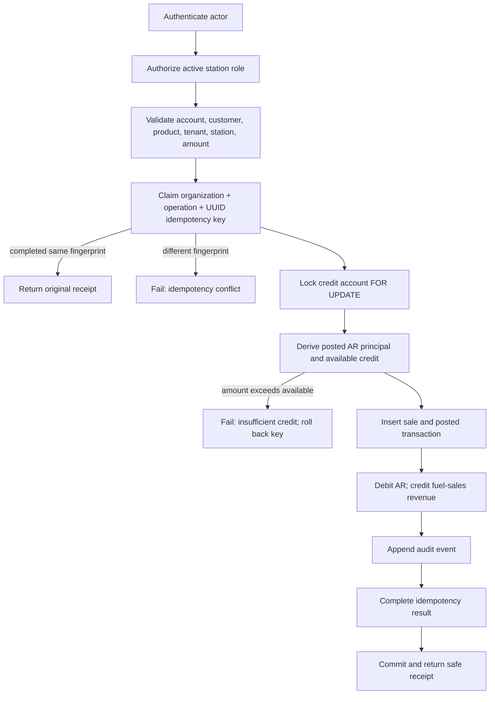

# Credit Posting Workflow

## Atomic customer creation

`create_customer_with_credit_account` executes as one database statement:

1. require `auth.uid()`;
2. load an active station and its organization;
3. admit only an active organization owner or that station's active manager;
4. validate trimmed names, the MVP E.164 phone rule (`+` and 8–15 digits),
   integral non-negative credit limit, interest rate, grace, and due-day ranges;
5. reject a duplicate phone only within that organization;
6. insert an active customer, its settings, and one active INR credit account;
7. append a safe audit event; and
8. return identifiers and non-PII account configuration.

An error rolls back every row. Status, currency, actor, tenant, timestamps, and
audit identity are server controlled.

## Atomic fuel-credit posting

`post_fuel_credit_transaction` performs the following in one transaction:

The account row is the serialization point. Every posting takes locks in the
same order—idempotency claim, then account—so different keys for one account
cannot both spend the same available credit. The balance is recalculated only
after the account lock.

## Idempotency

The client supplies a high-entropy UUID. Scope is organization plus operation.
A SHA-256 fingerprint covers account, station, product, integral amount, and
the optional non-PII source reference. It contains no name, phone, credential,
token, or secret.

- Same key and same fingerprint: return the stored original receipt with no new
  transaction, entries, sale, or audit event.
- Same key and a different field: fail with `FCP_IDEMPOTENCY_CONFLICT`.
- Failed posting: the idempotency insert rolls back, so a corrected retry may
  reuse the key.

## Stable application errors

Expected rejections use stable, non-diagnostic codes beginning `CCC_` or
`FCP_`, including authentication, authorization, station, tenant/scope,
inactive entity, validation, overflow, idempotency conflict, and insufficient
credit. Raw SQL error text and internal identifiers are not deliberately
returned for expected business failures.

## Audit and privacy

Customer creation and posting append `audit_events` in the same transaction.
Events derive actor, role, organization, and station. Financial events include
only safe identifiers, amount, currency, product ID, transaction ID, account
ID, and idempotency UUID. Names, phones, addresses, JWTs, QR data, credentials,
and free-form source references are excluded from audit JSON.

## Phase 2D corrections

An eligible posted fuel sale can now be corrected only through a governed
request, independent owner approval, and exact current-date compensating
transaction. A replacement uses this same trusted posting function and remains
on the original organization, station, customer, and credit account.

Reversal is blocked after any FIFO principal consumption or source-linked
interest. Replacement product, amount, and credit are revalidated under the
account lock; failure rolls the reversal back.

QR lookup, receipts as documents, inventory, pricing/litres, pumps/nozzles,
cash reconciliation, and clients remain deferred.
