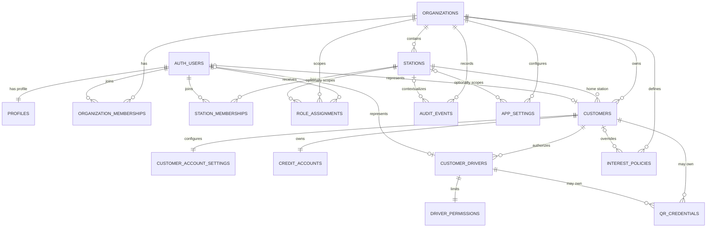

# Initial Entity Relationship Diagram

This diagram describes the Phase 1 foundation. It intentionally has no transaction or ledger table.

## Relationship invariants

- Every tenant-owned row carries an organization relationship; station-scoped rows use composite foreign keys to prove that the station belongs to the same organization.
- A driver has one required customer and no relationship to `credit_accounts`.
- A QR credential belongs to exactly one customer or one driver.
- A customer has one credit account and one account-settings row in this initial model.
- An interest policy with no customer is an organization default; a customer relationship makes it an override.
- No stored balance in Phase 1 is an authoritative financial source of truth.
