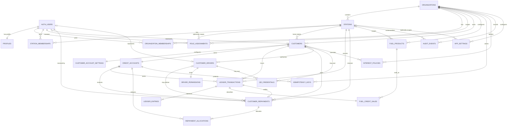

# Entity Relationship Diagram

This diagram includes the Phase 2A credit-posting and Phase 2B repayment
entities on the Phase 1 foundation.

## Relationship invariants

- Every tenant-owned row carries an organization relationship; station-scoped rows use composite foreign keys to prove that the station belongs to the same organization.
- A driver has one required customer and no relationship to `credit_accounts`.
- A QR credential belongs to exactly one customer or one driver.
- A customer has one credit account and one account-settings row in this initial model.
- An interest policy with no customer is an organization default; a customer relationship makes it an override.
- No stored balance is authoritative. Posted principal- and
  interest-receivable entries are the sources of outstanding principal and
  interest.
- A fuel transaction has one sale and exactly two equal ledger entries.
- A repayment has one immutable business record and one or two immutable
  allocations that sum to its total. Its ledger transaction has one cash debit
  and the exact principal and/or interest receivable credits required by its
  mode.
- A driver relationship on a repayment is physical-payer attribution only; the
  customer credit account remains the sole financial account.
- Product scope is either organization-wide or one station, always in the same
  organization.
- An organization/operation/idempotency-key tuple identifies one request
  fingerprint and one operation-specific completed result, preventing a
  repayment key from colliding with a fuel-posting key.
