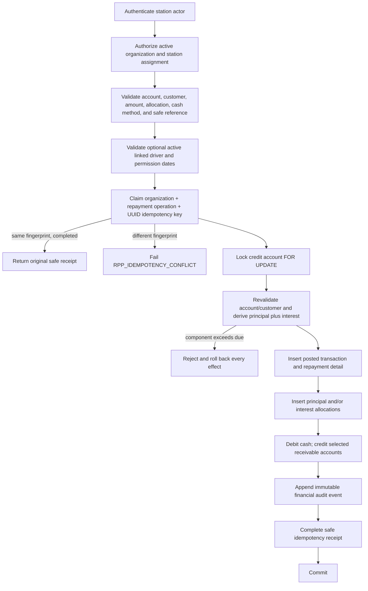

# Repayment Allocation Workflow

## Staff-facing behavior

An owner, assigned manager, or assigned attendant receives cash and selects
the customer credit account. The server returns authoritative principal,
interest, total due, and available credit. The employee then chooses:

- `PRINCIPAL_ONLY`: all cash reduces principal;
- `INTEREST_ONLY`: all cash reduces posted interest;
- `SPLIT`: exact positive principal and interest components must sum to the
  total cash received.

The backend never applies interest first, redirects an excess component,
creates unallocated credit, or accepts an overpayment.

## Atomic posting sequence



The idempotency row is claimed before the account lock, matching Phase 2A lock
ordering. Fuel-credit posting and repayment both serialize on the same account
row, so competing operations recalculate from committed ledger state.

## Allocation validation

All amounts are integral `BIGINT` paise after checked `NUMERIC` validation.

| Mode | Principal | Interest | Required ledger credits |
|---|---:|---:|---|
| `PRINCIPAL_ONLY` | total | 0 | one AR credit |
| `INTEREST_ONLY` | 0 | total | one interest-receivable credit |
| `SPLIT` | positive explicit value | positive explicit value | one credit for each component |

For split, the components must exactly equal the total. A zero split component
is rejected; the employee must choose the matching one-sided mode. Principal
cannot exceed posted principal, and interest cannot exceed posted interest.

## Driver attribution

No driver ID means the customer delivered the payment. A supplied driver must:

1. exist in the same organization;
2. belong to the account customer;
3. have `ACTIVE` driver status;
4. have a permission record effective today and not expired.

The repayment stores the physical payer separately from the authenticated
employee who received the cash. Driver attribution never grants posting
authority and never creates a driver balance or credit account. After the
credit-account lock, the function revalidates the driver and permission under
`FOR SHARE` row locks so a concurrent status or expiration update cannot
invalidate attribution before commit.

## Accounting meaning

Staff-facing "paying credit" means reducing what the customer owes. Database
debit and credit retain their double-entry accounting meanings:

```text
Principal-only
  Debit  CASH_ON_HAND
  Credit CUSTOMER_ACCOUNTS_RECEIVABLE

Interest-only
  Debit  CASH_ON_HAND
  Credit CUSTOMER_INTEREST_RECEIVABLE

Split
  Debit  CASH_ON_HAND                    = total
  Credit CUSTOMER_ACCOUNTS_RECEIVABLE    = principal allocation
  Credit CUSTOMER_INTEREST_RECEIVABLE    = interest allocation
```

Deferred constraints require debit total to equal credit total, repayment
allocations to equal the cash total, and the exact entry shape to match the
selected mode.

## Derived balances

```text
outstanding principal = posted AR debits - posted AR credits
outstanding interest  = posted interest-receivable debits
                        - posted interest-receivable credits
total due             = outstanding principal + outstanding interest
available credit      = credit limit - outstanding principal
```

Principal repayment increases available credit. Interest repayment does not.
Negative obligations and arithmetic overflow are rejected.

## Idempotency and audit

The UUID key is unique within organization plus operation. Its SHA-256
fingerprint binds organization, station, account, total, mode, canonical
allocations, payer driver or customer payer, payment method, and safe
reference. It contains no name, phone, token, secret, or free-form private
data.

A successful repayment writes one immutable audit event in the transaction.
The event records derived actor/role, organization, station, customer, account,
repayment, ledger transaction, allocations, payer type/driver ID, cash method,
and safe request UUID. Replay creates no second event.

## Stable failures

Expected failures use `RPP_` codes for authentication, authorization, invalid
station/account/customer, invalid amount or allocation, principal/interest
excess, nothing due, driver state, idempotency conflict/retry, invalid cash
method or reference, and overflow. Internal SQL structure and stack details are
not deliberately returned.

## Deferred behavior

Automated simple-interest calculation, grace-policy execution, daily accrual,
compounding, manual production interest charging, non-cash methods,
overpayment/customer credit, refunds, reversals, QR resolution, and client UI
are not implemented in Phase 2B.
