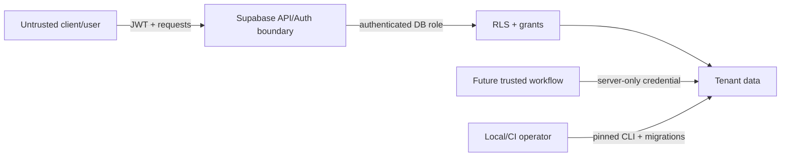

# Threat Model

## Scope and assets

Phase 1 protects tenant identity, role assignments, customer and driver personal data, credit configuration, QR credential hashes, interest policies, audit records, and settings in local Supabase. The future financial ledger is not yet present.

Primary assets are authorization integrity, tenant isolation, customer privacy, exact financial configuration, QR token confidentiality, audit immutability, and server credentials.

## Trust boundaries

Clients, JWT custom/user metadata, request parameters, QR payloads, imported files, and audit JSON are untrusted. Database constraints, verified Auth identity, RLS, and narrowly scoped server-side functions form the authorization boundary.

## STRIDE analysis

| Threat | Example | Phase 1 mitigation | Residual/future work |
|---|---|---|---|
| Spoofing | Caller supplies another user/organization ID | Helpers derive actor from `auth.uid()`; no actor parameters; tenant FKs | Strong MFA/session policy belongs to deployment |
| Tampering | Manager edits own role or credit limit | No direct client grants/policies; role and customer foundations are read-only | Audited owner/admin workflows still needed |
| Repudiation | Sensitive change lacks evidence | Immutable audit table and required future atomic audit writes | Retention/export monitoring not implemented |
| Information disclosure | Cross-tenant customer or setting query | Forced RLS, active membership checks, role tests, minimal driver RPC | Column classification and production log review |
| Denial of service | Expensive unindexed RLS predicates | Indexed foreign keys and authorization lookup columns | Rate limiting and query monitoring at deployment |
| Elevation of privilege | SECURITY DEFINER function bypasses RLS | Private schema, empty `search_path`, explicit `auth.uid()`, revoked default execute, fixed return projection | Every new privileged function requires review/tests |

## QR threats

A displayed QR token can be photographed or replayed. The database stores only a SHA-256-style hash representation with expiration, revocation, rotation, and last-used metadata. The payload must contain no PII, account ID, balance, credit limit, JWT, or authorization decision. Future scan/posting flows must rate-limit verification, compare hashes safely, require an authenticated station actor, reject revoked/expired tokens, and avoid revealing whether an arbitrary token exists.

## Sensitive data handling

- Passwords remain in Supabase Auth; no custom password hashes are created.
- Service-role keys are server-only and must never enter Flutter, Next.js browser bundles, logs, seed data, or committed environment files.
- Audit before/after JSON is minimized and must exclude passwords, JWTs, QR secrets/hashes, service keys, and unnecessary contact/address fields.
- Phase 1 fake fixtures use `.example.test` emails, reserved fictional phone values, and deterministic non-production UUIDs.

## Abuse cases covered by pgTAP

Anonymous reads, cross-tenant owner reads, manager station hopping, attendant customer browsing and credit-limit changes, customer cross-account reads, driver overreach, self-promotion, ownership spoofing, audit mutation, revoked membership, deactivated driver access, and broad permissive policies are all explicitly tested.

## Remaining security work

Before production: professional security review, production secrets management, MFA/session requirements, trusted role-management functions, atomic financial posting, idempotency, abuse/rate controls, backup encryption and restore drills, audit retention/alerting, dependency scanning, and incident response.

This threat model is an engineering baseline, not a substitute for a professional security audit.
