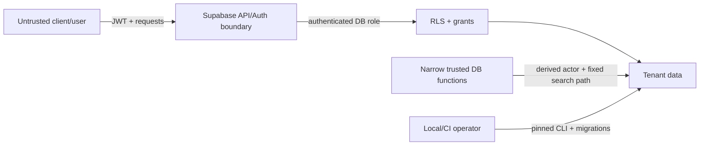

# Threat Model

## Scope and assets

Phase 2C protects tenant identity, role assignments, customer and driver
personal data, credit configuration, QR credential hashes, interest policies,
fuel products, append-only sales and repayments, explicit allocations,
operation-specific idempotency results, audit records, and settings in local
Supabase.

Interest policies, station timezones, immutable transaction business dates,
daily calculation evidence, fractional carry, and scheduler authority are
also accounting-security assets.

Primary assets are authorization integrity, tenant isolation, customer privacy,
exact principal/interest obligations, ledger/audit immutability, idempotency
integrity, QR token confidentiality, and server credentials.

## Trust boundaries

Clients, JWT custom/user metadata, request parameters, QR payloads, imported
files, and audit JSON are untrusted. Database constraints, verified Auth
identity, RLS, and narrowly scoped server-side functions form the authorization
boundary.

## STRIDE analysis

| Threat | Example | Phase 2B mitigation | Residual/future work |
|---|---|---|---|
| Spoofing | Caller supplies another actor, customer, tenant, or station | Functions derive actor from `auth.uid()` and account/station relationships; no actor/tenant/customer parameters | Strong MFA/session policy belongs to deployment |
| Spoofing | Caller uses a driver ID as authority or attributes another customer's driver | Driver is attribution only; server verifies tenant, parent customer, `ACTIVE` status, and permission dates before and after the account lock, then holds `FOR SHARE` locks through commit | QR-based resolution and driver lifecycle workflows are future work |
| Tampering | Caller changes principal/interest allocation or submits a mismatched total | Integral-paise validation, explicit mode rules, obligation checks, allocation constraints, and exact ledger-shape trigger | Staff dual-control thresholds may be added later |
| Tampering | Concurrent repayments overpay one obligation | Fuel and repayment functions use the same account `FOR UPDATE` boundary and post-lock ledger calculation; separate-session races verify it | Limit-change and future accrual workflows must keep the lock order |
| Tampering | Manager edits role, repayment, allocation, ledger, or audit rows | Least-privilege grants, forced RLS, trusted mutation functions, and hard update/delete triggers | Audited owner/admin workflows still needed |
| Repudiation | Cash receipt lacks employee, physical payer, or allocation evidence | Same-transaction immutable audit stores derived actor/role, safe identifiers, exact allocations, payer type, and method | Retention/export monitoring and cash reconciliation are not implemented |
| Information disclosure | Receipt or audit leaks PII, notes, fingerprint, tokens, or keys | Safe receipt projection, normalized bounded reference, minimized audit JSON, and explicit tests excluding sensitive fields | Production log/telemetry review remains required |
| Denial of service | Expensive RLS or oversized amount/text | Indexed foreign keys/lookups, bounded text, exact amount validation, and short account-lock transaction | Rate limiting, statement timeouts, and monitoring belong to deployment |
| Elevation of privilege | `SECURITY DEFINER` bypasses tenant rules | Empty `search_path`, fully qualified objects, `auth.uid()`, explicit role checks, narrow returns, and execute revocations/grants | Every new privileged function requires focused review |
| Replay/tampering | Duplicate payment or same key with changed payload | Organization + operation + UUID claim and SHA-256 fingerprint over material non-secret inputs; replay returns stored result and conflicts fail | Client key generation quality must be enforced in future clients |
| Arithmetic | Negative, fractional, or overflowing amounts corrupt balances | Positive integral validation, `NUMERIC` intermediates, checked `BIGINT` casts/addition/subtraction, and negative-obligation rejection | Load/performance limits require staging measurement |
| Tampering | Client backdates interest or spoofs rate/grace policy | No client accrual RPC; engine derives stored business dates and effective policy server-side; evidence snapshots the result | Operator policy-change workflow needs dual-control design |
| Tampering | Duplicate scheduler/catch-up compounds interest | Account/date/version uniqueness, shared account lock, FIFO fuel-only basis, named cron job, and safe replay | Production alerting on repeated failures is future work |
| Elevation of privilege | pg_cron command exposes a secret or client-callable global trigger | Fixed SQL command, no HTTP/key, controlled job name, revoked cron schema and function execution | Hosted-project job owner and monitoring require deployment review |
| Information disclosure | Components leak customer PII | Evidence stores UUID relationships and accounting snapshots only; RLS limits raw reads to owner/assigned manager | Export/report redaction remains future work |

## Accounting-specific abuse cases

- Principal and interest are separate receivable accounts. Excess in one
  component is never redirected to the other.
- Split components must both be positive, sum exactly to total cash, and fit
  their authoritative obligations. One-sided intent uses the one-sided mode.
- Overpayments, unallocated customer credit, refunds, and negative obligations
  are rejected rather than represented implicitly.
- Transaction-type-specific deferred constraints enforce the expected two- or
  three-entry shape and debit/credit equality.
- Production interest charges are created only by the private account-locked
  engine. No normal-client interest-charge RPC exists.
- Only fuel-principal debit lots enter the basis. Interest receivable,
  previously posted interest, and total due are structurally excluded, so the
  engine cannot compound.
- A disabled policy stops new raw interest without forgiving historical
  receivable. Inactive accounts with debt remain eligible unless policy
  disables them.

## QR threats

A displayed QR token can be photographed or replayed. The database stores only
a hash with expiration, revocation, rotation, and last-used metadata. The
payload must contain no PII, account ID, balance, credit limit, JWT, or
authorization decision. Future scan/posting flows must rate-limit verification,
compare hashes safely, require an authenticated station actor, reject
revoked/expired tokens, and avoid revealing whether an arbitrary token exists.

## Sensitive data handling

- Passwords remain in Supabase Auth; no custom password hashes are created.
- Service-role keys are server-only and must never enter client bundles, logs,
  seed data, or committed environment files.
- Audit JSON excludes passwords, JWTs, QR secrets/hashes, service keys,
  idempotency fingerprints, source-reference text, and private customer fields.
- Fake fixtures use `.example.test` emails, fictional phone values,
  deterministic non-production UUIDs, and no live account data.

## Verification

pgTAP covers anonymous and role denial, cross-tenant and cross-station scope,
actor/customer/driver spoofing, revoked/expired state, malformed and excessive
allocations, checked arithmetic, same/different-payload idempotency, direct
financial writes, exact ledger/allocation constraints, immutable rows, audit
minimization, and tenant-isolated balances.

The Phase 2A race proves two concurrent INR 700 purchases cannot overspend an
INR 1,000 limit. The Phase 2B race proves two concurrent INR 700 repayments
cannot overpay INR 1,000 principal and that the loser leaves no artifacts. A
mixed fuel-versus-repayment race proves both functions serialize on the same
account row. A third race proves a concurrent non-key driver-status revocation
waits for the attributed repayment to commit.

The Phase 2C harness proves duplicate account/date workers create one logical
calculation and at most one ledger/audit effect. It also proves accrual
serializes behind same-day repayment and fuel posting on the shared account
lock, observes a complete closing balance, and respects a new fuel lot's grace
threshold. The scheduler check verifies registration and privileges only; it
does not claim a real wall-clock cron firing.

## Remaining security work

Before production: independent professional financial/security review,
production secrets management, MFA/session requirements, trusted
role/limit/product/driver-management functions, automated interest policy
review, reversal/refund/reconciliation controls, abuse/rate controls, backup
encryption and restore drills, audit retention/alerting, dependency scanning,
statement timeouts, cash custody controls, and incident response.

This threat model is an internal engineering review, not an independent
professional financial or security audit.
