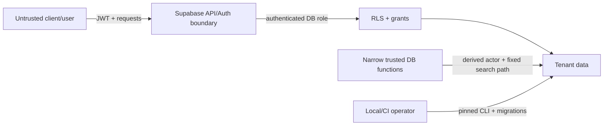

# Threat Model

## Scope and assets

Phase 2A protects tenant identity, role assignments, customer and driver
personal data, credit configuration, QR credential hashes, interest policies,
fuel products, append-only financial records, idempotency results, audit
records, and settings in local Supabase.

Primary assets are authorization integrity, tenant isolation, customer privacy,
exact financial configuration and balances, ledger/audit immutability,
idempotency integrity, QR token confidentiality, and server credentials.

## Trust boundaries

Clients, JWT custom/user metadata, request parameters, QR payloads, imported files, and audit JSON are untrusted. Database constraints, verified Auth identity, RLS, and narrowly scoped server-side functions form the authorization boundary.

## STRIDE analysis

| Threat | Example | Phase 2A mitigation | Residual/future work |
|---|---|---|---|
| Spoofing | Caller supplies another user/organization ID | Helpers derive actor from `auth.uid()`; no actor parameters; tenant FKs | Strong MFA/session policy belongs to deployment |
| Tampering | Manager edits own role or credit limit | No direct client grants/policies; role and customer foundations are read-only | Audited owner/admin workflows still needed |
| Repudiation | Customer creation or posting lacks evidence | Same-transaction immutable audit writes with derived actor/scope | Retention/export monitoring not implemented |
| Information disclosure | Cross-tenant customer or setting query | Forced RLS, active membership checks, role tests, minimal driver RPC | Column classification and production log review |
| Denial of service | Expensive RLS or oversized request | Indexed foreign keys/lookups and bounded text/amount validation | Rate limiting, statement timeouts, and monitoring at deployment |
| Elevation of privilege | `SECURITY DEFINER` function bypasses RLS | Empty `search_path`, qualified objects, `auth.uid()`, explicit execute grants, fixed return projection | Every new privileged function requires review/tests |
| Tampering | Concurrent posts both spend the same credit | Idempotency claim plus credit-account `FOR UPDATE`, post-lock balance calculation, separate-session race test | Repayment/limit-change workflows must use the same lock order |

## QR threats

A displayed QR token can be photographed or replayed. The database stores only a SHA-256-style hash representation with expiration, revocation, rotation, and last-used metadata. The payload must contain no PII, account ID, balance, credit limit, JWT, or authorization decision. Future scan/posting flows must rate-limit verification, compare hashes safely, require an authenticated station actor, reject revoked/expired tokens, and avoid revealing whether an arbitrary token exists.

## Sensitive data handling

- Passwords remain in Supabase Auth; no custom password hashes are created.
- Service-role keys are server-only and must never enter Flutter, Next.js browser bundles, logs, seed data, or committed environment files.
- Audit before/after JSON is minimized and must exclude passwords, JWTs, QR secrets/hashes, service keys, and unnecessary contact/address fields.
- Fake fixtures use `.example.test` emails, reserved fictional phone values,
  deterministic non-production UUIDs, and no live account data.

## Abuse cases covered by pgTAP

Anonymous access, cross-tenant owners, manager station hopping, attendant
customer/ledger browsing, customer/driver posting, raw financial writes,
inactive entities, over-limit posts, duplicate/change-payload idempotency,
ledger imbalance and mutation, revoked membership, and broad permissive
policies are explicitly tested. A separate-session harness proves two
concurrent INR 700 requests cannot overspend an INR 1,000 account.

## Remaining security work

Before production: professional security review, production secrets
management, MFA/session requirements, trusted role/limit/product-management
functions, repayment/reversal/reconciliation controls, abuse/rate controls,
backup encryption and restore drills, audit retention/alerting, dependency
scanning, statement timeouts, and incident response.

This threat model is an engineering baseline, not a substitute for a professional security audit.
